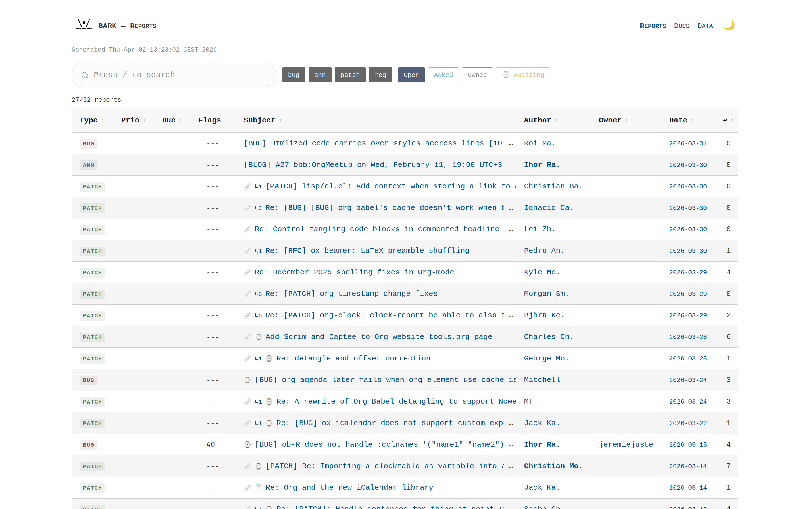

#+title: BARK! Another Report Keeper

[[https://www.repostatus.org/#active][https://img.shields.io/badge/status-active-brightgreen.svg?style=for-the-badge]]
[[https://intver.org/][https://img.shields.io/badge/versioning-intver.org-blue.svg?style=for-the-badge]]

BARK is an email-driven report tracker - see the [[docs/bark-manual.org#principles][principles]].

BARK monitors a single IMAP mailbox, classifies incoming emails into
sources by header matching, detects report types from subject tags,
applies commands from email body, and manages roles per source.

BARK reports can be read with other tools:

- As a CLI based on [[https://junegunn.github.io/fzf/][fzf]]: [[https://codeberg.org/bzg/bone][bone]]
- Via GNU Emacs [[https://gnus.org][Gnus]]: [[https://codeberg.org/bzg/gnus-bone][gnus-bone]]
- Via GNU Emacs [[https://notmuchmail.org/notmuch-emacs/][notmuch]]: [[https://codeberg.org/bzg/notmuch-bone][notmuch-bone]]

* BARK manual

For a more extensive documentation, please read the [[docs/bark-manual.org][BARK manual]].

* How it works

- *JVM daemon* (=clojure -M:run=) --- Connects to IMAP, stores emails,
  digests them into reports, applies commands and roles, periodically
  expires stale reports. All database writes happen here.
- *bb export* --- Exports reports as JSON, RSS, Org, ICS (calendar),
  and generates HTML and stats pages. Read-only (no database writes).
- *bb notify* --- Sends notification emails to admin/maintainers.
  Read-only (no database writes).

* Dependencies

- [[https://babashka.org/][Babashka]] (bb) for export, notify, and utility scripts
- [[https://github.com/datalevin/datalevin][Datalevin]] (pod for bb scripts, library for JVM)
- Java 17+ (for the daemon)

* Quick start

#+begin_src sh
# 1. Copy and edit config
cp config.edn.example config.edn

# 2a. Start the daemon (dev)
clj -M:run

# 2b. Or build an uberjar and run it (production)
mkdir -p classes
clj -M -e "(compile 'bark.main)"
clj -M:uberdeps --main-class bark.main
java --add-opens=java.base/java.nio=ALL-UNNAMED \
     --add-opens=java.base/sun.nio.ch=ALL-UNNAMED \
     --enable-native-access=ALL-UNNAMED \
     -jar target/bark.jar

# 3. Export reports
bb export          # incremental (skips if nothing changed)
bb export all      # all formats
bb export json     # JSON only
bb export rss      # RSS only
bb export org      # Org only
bb export html     # HTML + JSON
bb export stats    # stats.json
bb export patches  # patch files
bb export text     # text attachments (text/plain, text/x-log)
bb export events   # ICS event files and calendar feeds
bb export all --force  # ignore timestamps, full export
bb export all --topics-filter "event"  # only reports with topic "event"
bb export root         # regenerate top-level index.html only

# 4. Send notification emails
bb notify              # send due notifications
bb notify --dry-run    # preview without sending
bb notify --force      # ignore intervals
bb notify --debug      # verbose filtering diagnostics

# 5. Test SMTP configuration
bb test-smtp --dry-run

# 6. Maintenance (purge orphan emails)
bb maintenance --verbose  # show orphans
bb maintenance --delete   # actually purge

# 7. Run tests
clj -M:test
#+end_src

* Architecture

All source code lives under =src/bark/=:

| Namespace     | Role                                                |
|---------------+-----------------------------------------------------|
| =bark.main=     | Daemon entry point (IMAP IDLE loop, store+digest)   |
| =bark.ingest=   | Datalevin connection, email parsing and storage     |
| =bark.digest=   | Single-email processing (classify, detect, thread)  |
| =bark.detect=   | Report type detection from subject/body/attachments |
| =bark.commands= | Triggers, directives, votes                         |
| =bark.roles=    | Permission checks and role management               |
| =bark.series=   | Patch series tracking                               |
| =bark.expire=   | Periodic report expiry (runs inside daemon)         |
| =bark.tracking= | Change-tracking for incremental export              |
| =bark.common=   | Shared utilities (JVM)                              |
| =bark.logging=  | File and email log appenders                        |

Read-only bb scripts live under =scripts/=:

| Script              | Role                                    |
|---------------------+-----------------------------------------|
| =bark-common.clj=     | Shared utilities (bb)                   |
| =bark-export.clj=     | Report export (JSON, RSS, Org, patches, events, text) |
| =bark-notify.clj=     | Notification emails                     |
| =bark-index.clj=      | HTML index page generation              |
| =bark-stats.clj=      | Statistics and data page generation     |
| =bark-docs.clj=       | Documentation page generation           |
| =bark-html.clj=       | HTML template helpers                   |
| =validate-config.clj= | Config validation                       |

* bb tasks

#+begin_example
bb export [json|rss|org|html|stats|patches|text|events|root|all]
       [-n source] [-p 1|2|3] [-s 1-7]   Filter by source, priority, status
       [--force]                          Ignore timestamps, full export
       [--only-open]                      Also export -open files (all-open.json, etc.)
       [--theme THEME]                    Override CSS theme (see below)
       [--topics-filter TOPICS]           Only export matching topics (comma-separated)
bb notify [--dry-run] [--force] [--debug] Send notification emails
bb maintenance [--delete] [--verbose] [-n source]  Purge orphan emails
bb test-config [path]                     Validate config.edn
bb test-smtp [--to addr] [--dry-run]      Test SMTP configuration
bb clean                                  Remove all files in public/
#+end_example

** Theme (=--theme= / =:theme=)

The =--theme= flag (or =:theme= in =config.edn=) controls the CSS
theme for HTML exports.  The value is resolved in order:

1. *https:// URL* — used as an external =<link>= stylesheet.
2. *file:///path* — the local file is read and inlined in a =<style>= block.
3. *Path ending in .css* — relative or absolute; inlined in =<style>=.
4. *Bare name* (no spaces, no =.css= suffix) — treated as a [[https://github.com/bzg/pico-themes][pico-themes]] name; the base theme and bark overlay are loaded from jsDelivr.

Set to ="none"= to disable theming entirely.

#+begin_src sh
bb export html --theme org                                  # pico-themes name
bb export html --theme https://example.com/custom.css       # external URL
bb export html --theme file:///home/user/my-theme.css       # local file (inlined)
bb export html --theme themes/custom.css                    # relative path (inlined)
bb export html --theme none                                 # no theme
#+end_src

* Configuration

See =config.edn.example=. The configuration has three main sections:

** IMAP connection (=:imap=)

Single IMAP connection shared by all sources.

| Field         | Required | Description                        |
|---------------+----------+------------------------------------|
| =:host=         | yes      | IMAP server hostname               |
| =:user=         | yes      | IMAP login username                |
| =:password=     | ​*        | IMAP password (* or =:oauth2-token=) |
| =:oauth2-token= | ​*        | OAuth2 token (* or =:password=)      |
| =:folder=       | yes      | IMAP folder (usually ="INBOX"=)      |

** Ingest settings (=:ingest=)

| Field                  | Default   | Description                                                  |
|------------------------+-----------+--------------------------------------------------------------|
| =:initial-fetch=         | =50=        | First-run fetch: count, duration (="30d"=), or ISO date        |
| =:max-size=              | none      | Skip emails larger than N bytes (e.g. =1048576=)               |
| =:max-attachment-size=   | =1048576=   | Max text data extracted from attachments (.patch, .ics, etc) |

** Sources (=:sources=)

Each source classifies incoming emails by delivery type.  Sources are
checked in order; the first match wins.  Each source must have exactly
one of the three type keys:

| Key    | Source type  | Matches against                                            |
|--------+--------------+------------------------------------------------------------|
| =:list=  | Mailing list | =List-Id= header (bare identifier, e.g. ="bugs.example.org"=)  |
| =:alias= | Email alias  | =X-Original-To=, =Envelope-To=, =X-Envelope-To=, or =Delivered-To= |
| =:to=    | Mailbox      | =Delivered-To= header                                        |

| Field                  | Required | Description                                                          |
|------------------------+----------+----------------------------------------------------------------------|
| =:name=                  | yes      | Unique source identifier                                             |
| =:list= / =:alias= / =:to=   | yes      | Exactly one (determines source type and header to match)             |
| =:admin=                 | no       | Admin for this source (fallback: global)                             |
| =:commands=              | no       | Command keyword overrides (per action)                               |
| =:labels=                | no       | Report label overrides (per report type)                             |
| =:maintainers=           | no       | Initial maintainers, e.g. =[{:email "dev@x.org" :since "2025-01-01"}]= |
| =:list-archive=          | no       | URL of the list archive (shown in HTML reports)                      |
| =:archive-format-string= | no       | URL template for message-ids (=%s= is replaced)                        |
| =:base-url=              | no       | Base URL where this source's public directory is served              |
| =:report-types=          | no       | Restrict detected types, e.g. =#{:bug :patch}=                         |
| =:export-formats=        | no       | Output formats (default: =["json" "org" "rss"]=)                       |
| =:export-reports=        | no       | Restrict exported types, e.g. =#{:bug :patch :request}=                |
| =:topics-filter=         | no       | Only export reports with matching topics, e.g. =["event"]=              |
| =:expiry=                | no       | Auto-close delays in days per type                                   |
| =:awaiting-delay=        | no       | Duration before "awaiting reply" flag, e.g. ="14d"= (default: 14 days) |

All state-changing actions (commands, role controls) must be sent
through the source's public channel to ensure reproducibility — anyone
running BARK on the same source sees the same state.

** Example config

#+begin_src clojure
{:admin "admin@example.com"
 :imap  {:host "imap.example.com" :port 993 :ssl true
         :user "imap-login@example.com" :password "secret"
         :folder "INBOX"}
 :sources [{:name "public-list"
            :list "bugs.example.org"
            :admin "lead@example.org"
            :list-archive "https://lists.example.org/bugs/"}
           {:name "team-alias"
            :alias "team@example.com"}
           {:name "direct-inbox"
            :to "inbox@example.com"}]
 :db {:path "data/bark-db"}
 :ingest {:initial-fetch 50
          :max-size 1048576}
 :notifications {:enabled true
                 :smtp {:host "smtp.example.com" :port 587 :tls true
                        :user "notify@example.com" :password "secret"
                        :from "bark@example.com"}}}
#+end_src

** Report labels (=:labels=)

Controls which subject labels are recognised per report type.

Can be set globally at the top level or per source (per-source takes
precedence). Only the types you specify are overridden; others keep
their defaults. Here are the default labels:

| Type          | Default labels   |
|---------------+------------------|
| =:bug=          | =BUG=              |
| =:patch=        | =PATCH=            |
| =:request=      | =POLL= =FR= =TODO=     |
| =:announcement= | =ANN= =ANNOUNCEMENT= |
| =:release=      | =REL= =RELEASE=      |
| =:change=       | =CHG= =CHANGE=       |

Example (global, in =config.edn=):

#+begin_src clojure
:labels {:bug     ["BUG" "DEFECT"]
                   :request ["POLL" "FR" "TODO" "RFE"]}
#+end_src

Per-source (inside a source map):

#+begin_src clojure
{:name "my-list"
 :labels {:announcement ["ANN" "NEWS"]}}
#+end_src

** Notifications (=:notifications=)

Optional. When absent or ={:enabled false}=, =bb notify= exits
immediately.

| Field    | Required | Description                          |
|----------+----------+--------------------------------------|
| =:enabled= | yes      | Global kill switch (=true=/=false=)    |
| =:smtp=    | yes      | SMTP connection settings (see below) |

SMTP fields:

| Field     | Required | Description               |
|-----------+----------+---------------------------|
| =:host=     | yes      | SMTP server hostname      |
| =:port=     | yes      | SMTP port (usually 587)   |
| =:tls=      | no       | Enable STARTTLS (=true=)    |
| =:user=     | yes      | SMTP login username       |
| =:password= | yes      | SMTP password             |
| =:from=     | yes      | Sender address for emails |

Use =bb test-smtp --dry-run= to validate the configuration without
sending, or =bb test-smtp= to send a test email to the global admin.

* Contributing

- Send a [[mailto:~bzg/barkyard@lists.sr.ht][bug report]] with =[BUG] bark: <SHORT EXPLICIT BUG DESCRIPTION>=
- Send a [[mailto:~bzg/barkyard@lists.sr.ht][patch]] with =[PATCH] bark: <COMMIT SUMMARY>=
- Send a [[mailto:~bzg/barkyard@lists.sr.ht][feature request]] with =[FR] bark: <FEATURE REQUEST>=
- Share any [[mailto:~bzg/barkyard@lists.sr.ht][other question or idea]]

You can also [[mailto:bzg@bzg.fr][send me an email]] and support my work on [[https://liberapay.com/bzg/][liberapay]].

* Intentional Versioning

This project uses [[https://intver.org][Intentional Versioning]], here are the three audiences:

- =Users= : administrators who deploy, configure, and operate BARK instances
- =Integrators= : consumers of the exported JSON/RSS/Org formats
- =Maintainers= : maintainers of the codebase

* Support the Clojure(script) ecosystem

If you like Clojure(script), please consider supporting maintainers by
donating to [[https://clojuriststogether.org][clojuriststogether.org]].

* License

Copyright © 2026 Bastien Guerry

The Clojure code is distributed under the Eclipse Public License 2.0
and the Javascript code is distributed under the Mozilla Public
License 2.0.
